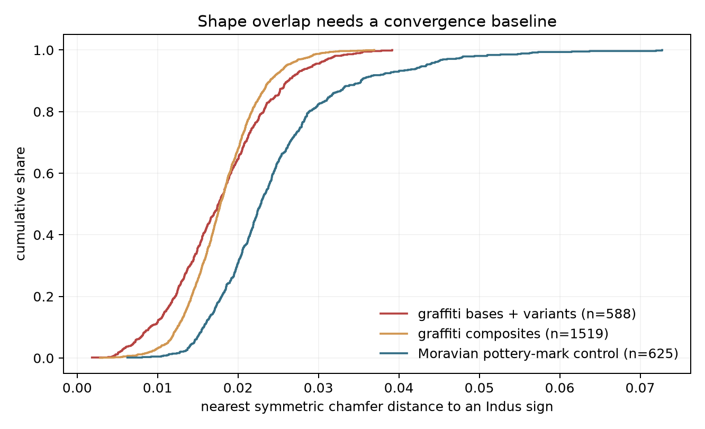

# 40 — Graffiti shapes clear one convergence control; the API has no texts

## Result

The headline result is a data limit. The public Tamil Nadu graffiti corpus is a
large **sign inventory**, but it is not a corpus of inscriptions. Its API gives
9,345 occurrences of 2,110 catalogue signs at 53 sites, with site, context,
ware, and depth marginals. It gives no sherd/accession identifier and no list of
marks in order on a sherd. Every plausible `filter?groupBy=` value returns the
same sign aggregate. The `position` field in `concordance` is the position of a
component *inside one graphical composite*, not a token position in a text.

Consequently this corpus cannot test the terminal slot, co-occurrence
exclusions, the no-repeat rule, numeral side, or segmentation. Signs reported
at one site are not treated as a text.

The fair tests that do not need sequences produce two positive comparisons and
one negative one:

- At the same 9,141-token sample size, graffiti has about four times the
  observed types and eight times the hapaxes of the Indus corpus. All four
  estimators say that neither inventory is saturated; the graffiti catalogue is
  much farther from saturation.
- Graffiti bases and variants are closer to this project's Indus glyphs than
  625 unrelated ninth-century Moravian pottery marks are. The probability that
  a random graffiti base/variant is closer than a random control mark is
  **.739**, and the result survives skeletonization and 90-degree rotation.
  This is evidence of above-control *shape proximity under this pipeline*, not
  a reproduction of the published 60%, 89%, or 90% claims.
- Once depth is defined within exact site × ware × habitation strata, none of
  three inventory-change statistics survives correction and no individual sign
  changes with depth after BH correction.

Megalithic graffiti are typically one mark per sherd, whereas the Indus texts
in this project average **4.4 signs in constrained order**. That is a difference
in what the two corpora record, not a claim about what either ancient system
could do. A shared repertoire of shapes with no shared syntax is a much weaker
form of continuity than shape-overlap headlines imply. Nothing here identifies
a language, an ethnicity, population continuity, or an origin for Brahmi.

## Source and scope

The harvest uses the public [Tamil Nadu graffiti site](https://tngraffiti.in/)
and its unauthenticated JSON API at
[`api.tamilknowledgecampus.in/graffiti/`](https://api.tamilknowledgecampus.in/graffiti/),
accessed **2026-08-17**. `src/scrape_graffiti.py` sends a browser-style
user-agent, makes sequential requests with a 0.25-second pause, and caches every
response. The raw JSON, SPA bundle, glyphs, crosswalk images, and control PDFs
remain under gitignored `data/graffiti/`; SHA-256 hashes of the core responses
are in `data/parsed/graffiti_compare.json`.

The distinction between the project and the live API matters. The Tamil Nadu
Department of Archaeology's
[published study](https://www.tnarch.gov.in/sites/default/files/IVC_PROCEEDINGS_RMRL.pdf)
describes 15,184 graffiti-bearing sherds from about 140 sites, of which 14,165
were documented, and a 2,107-sign classification containing 42 bases, 544
variants, and 1,521 composites. It reports morphological parallels for 60% of
the bases/variants and more than 90% of all marks. The current public API is a
53-site subset with 9,345 occurrences and **2,110** signs: 42 bases, **546**
variants, and **1,522** composites. The three-type discrepancy is reported, not
silently reconciled. Lal's earlier 89% comparison is in the
[1960 ASI report](https://ignca.gov.in/Asi_data/18414.pdf). Neither historical
percentage supplies a machine-reproducible matching rule, so this round does
not treat either as a target to recover.

The government corpus is used for scholarly scrutiny, but the raw redistribution
is deliberately excluded from git. The external control is Michal Hlavica's
[Early Medieval Pottery Marks from Moravia](https://doi.org/10.5281/zenodo.7965768),
a CC-BY-4.0 inventory of ninth-century marks with 633 downloadable drawings.
Its date and geography make historical contact with either comparison corpus
implausible for this control; it estimates graphical convergence and source
effects, not a universal null for all marking systems.

## 40.1 — What the API actually records

### Sequence audit

| check | result |
|---|---|
| `filter?groupBy=sign` | 2,110 sign rows; 9,345 occurrences |
| `groupBy=sherd`, `pottery`, `accession`, `object`, or `record` | byte-identical to the sign response; returned `groupBy` remains `sign` |
| `groupBy=site`, `ware`, `habitation`, or `depth` | also byte-identical sign responses |
| keys in site, sign, concordance, options, and crosswalk payloads | no sherd, accession, artefact, inscription, text, or sequence identifier |
| endpoints referenced by the SPA bundle | `base-sign`, `sites`, `fields-symbols`, `sign/<base>`, `concordance`, `options`, `filter`, and `indus`; no record/text route |
| `concordance` slots `s1`…`s6` | glyph IDs composing one graphical sign |

The last point can be checked rather than inferred. Catalogue item `1.1C` has
RMRL slots `[87, 1]`; the site's own mapping resolves those to TNSDA signs
`[39, 1]`. Its `position: 2` says that queried sign 1 occupies the second part
of the composite 39+1. It does not say that sign 1 was second on a sherd.

The following tests are therefore **impossible on the released corpus**:

| proposed test | missing datum |
|---|---|
| terminal-slot test | ordered tokens and a last position |
| co-occurrence exclusion | a sherd/text membership key |
| no-repeat rule | repeated tokens within a record |
| numeral-side | relative order around a numeral |
| segmentation | ordered multi-token records |

Replacing any of these with “occurs at the same site” would fabricate texts
from an excavation-level aggregate. No such substitution is made.

### Corpus shape

Unknown markers are excluded from the Indus side and its texts are deduplicated
at the project's usual `(sequence, site, object)` unit. Graffiti types are the
API's catalogue labels; occurrences are not deduplicable further because the
API exposes no record ID.

| measure | Tamil Nadu graffiti API | merged Indus corpus |
|---|---:|---:|
| distinct signs | **2,110** | **515** |
| sign tokens / occurrences | **9,345** | **9,141** |
| hapaxes | **1,370** | **168** |
| hapax rate | **64.9%** | **32.6%** |
| sites/site codes | **53** | **52** |
| records | unavailable; occurrence aggregate only | **2,085 texts** |
| unit of analysis | sherd-mark occurrence aggregated by sign | deduplicated ordered text |
| mean text length | unavailable | **4.384 signs** |

The graffiti corpus is concentrated. Thulukkarpatti contributes 2,887
occurrences, Keeladi 1,525, Kodumanal 1,291, and Perumbalai 940: together
**71.1%** of the API total. Black-and-Red Ware contributes 5,954; Red Ware
1,355; and Red Slipped Ware 1,204, together **91.1%**. Context is even more
imbalanced: 9,251 occurrences are labelled Habitation, 91 Burial, and 3
Habitation/Burial. A pooled burial/habitation contrast would therefore be both
confounded and extremely underpowered; it is described, not promoted to an
inferential test.

The API's internal totals are not perfectly closed. Site marginals in `filter`
sum to 9,345, while `sites` reports four additional occurrences: +2 at
Thulukkarpatti, +1 at Pattaraiperumbudur, and +1 at Nedungur. The frequency
spectrum and all analyses use the self-consistent 9,345-token `filter` table.
Depth marginals sum to 9,328. Although `options` advertises 38 bands, sign rows
return 570 raw labels, mainly numeric depths plus `Surface` and `NA`.

## 40.2 — Inventory saturation at matched size

The larger graffiti spectrum is sampled without replacement down to **9,141
tokens**, 500 times. The Indus corpus already has that size. Good–Turing here is
the note-35 coverage extrapolation, while Chao1 and ACE are singleton-sensitive
lower-bound estimators. Parentheses on graffiti values are 95% intervals over
the matched subsamples.

| estimator at 9,141 tokens | graffiti | Indus |
|---|---:|---:|
| observed types | 2,080 (2,071–2,089) | 515 |
| singleton types | 1,352 (1,341–1,364) | 168 |
| sample coverage | .8521 (.8508–.8533) | .9816 |
| Good–Turing coverage total | 2,441 (2,427–2,454) | 525 |
| Chao1 | **5,438** (5,309–5,606) | **715** |
| ACE | **5,847** (5,754–5,952) | **695** |
| Heaps exponent β | .699 (.674–.722) | .426 (.398–.459) |
| Heaps projection at 2× tokens | 3,444 (3,332–3,543) | 720 (692–752) |

For the Heaps curve, each run first takes a matched sample without replacement
and then randomizes its token order; it does not invent sequences. At the full
9,345 graffiti tokens the point estimates are 2,110 observed, 2,472
Good–Turing, 5,508 Chao1, and 5,935 ACE.

Neither inventory is saturated. The Indus estimates reproduce note 35 and put
the unseen tail in the hundreds. The graffiti estimators put it in the
thousands, driven by 1,370 singleton catalogue items. This is a comparison of
cataloguing/frequency spectra, not necessarily of cognitive sign inventories:
the graffiti classification explicitly counts composites as separate types,
and archaeological recovery and editorial splitting also generate rare forms.
Matching token count removes the most immediate sample-size explanation, not
those classification differences.

## 40.3 — Bases, variants, and composites

| catalogue branch measure | graffiti | Indus |
|---|---:|---:|
| bases | 42 | 71 |
| variants | 546 | 490 |
| variants/base, mean | **13.00** | **6.90** |
| variants/base, median | 10 | 6 |
| variants/base, SD | 9.53 | 5.59 |
| variants/base, Gini | .395 | .448 |
| variants/base, maximum | 39 | 24 |
| composites | 1,522 | not commensurately coded |
| composites/base, mean / median | 36.24 / 24 | — |
| composites/base, Gini / maximum | .481 / 179 | — |

The raw variant rate is 1.884 times the Indus rate (Poisson-rate
*z*=10.18, *p*=2.5×10⁻²⁴). That test is real but answers the scale-sensitive
question: the larger graffiti inventory is organized under fewer bases. To
control for the different inventory sizes, counts within each corpus are
divided by their corpus mean. The normalized distributions do not differ at
.05 (two-sample KS *D*=.238, *p*=.081), nor does their concentration (Gini
difference −.053, bootstrap 95% −.144 to .029; centered *p*=.228).

Thus graffiti has more named branches per base, but the *shape* of branching
across bases is not demonstrably different after scale normalization. The
1,522 graphical composites are a major additional catalogue layer. The Indus
font contains 44 multi-codepoint renderings, but those are not an independently
defined base-indexed composite class, so a composites/base ratio for Indus
would be false precision and is left blank.

## 40.4 — The convergence control

### Comparison design

All three inventories are normalized to aspect-preserving 64×64 binary masks.
The primary outcome is each mark's nearest symmetric centered chamfer distance
to any of the 515 rendered Indus signs, using the metric in `src/shapes.py`.
Lower is closer. Exact duplicate normalized masks are removed within each
category: all 588 graffiti bases/variants remain; 1,519 of 1,522 composites
remain; all 625 usable controls remain.

The Moravian archive contains 633 PDFs rather than bare glyph files. Each page
also includes labels, a scale, and a sherd outline. The extractor selects the
largest grey sherd, closes and fills it, erodes its boundary, and retains only
dark strokes inside. Representative pages and extracted masks were visually
checked; eight pages normalize blank and are reported as failures. This yields
625 controls. Skeletonized and 90-degree-rotation-invariant analyses test two
obvious rendering choices. A further attempt to pair graffiti and controls by
four graphical-complexity descriptors fails balance (absolute standardized
differences up to .99), so that superficially favourable paired result is not
used as evidence.



| query inventory | n | median nearest-Indus distance | control median | P(query closer), AUC |
|---|---:|---:|---:|---:|
| graffiti bases + variants | 588 | **.01758** | .02282 | **.739** |
| graffiti composites | 1,519 | **.01781** | .02282 | **.754** |
| all unique graffiti forms | 2,107 | **.01777** | .02282 | **.750** |

For bases/variants, the median control-minus-graffiti difference is .00524
(bootstrap 95% .00438–.00619); the one-sided Mann–Whitney probability is below
floating-point resolution. The effect is not just line width or orientation:

| sensitivity, bases + variants | graffiti median | control median | AUC | *p* |
|---|---:|---:|---:|---:|
| skeletonized | .02154 | .02644 | .720 | 3.0×10⁻⁴⁰ |
| allow 0°, 90°, 180°, 270° | .01446 | .02017 | .781 | 1.8×10⁻⁶⁴ |
| rotation + skeletonization | .01866 | .02393 | .765 | 1.2×10⁻⁵⁷ |

On these continuous measures, the Indus↔graffiti resemblance **does survive
this convergence baseline**. That conclusion is narrower than a percentage of
“matching signs.” When the pre-existing note-17 aligned-Dice allograph cutoff
of distance ≤.0043 is applied unchanged, **0/588 graffiti forms and 0/625
controls match**. The published 60%/89%/90% figures used morphological judgement
whose thresholds and eligible denominators are not recoverable here; the
pipeline neither reproduces nor falsifies them. It finds a distributional
advantage over one unrelated pottery-mark corpus.

There is also an unresolved source-quality asymmetry. Graffiti and Indus masks
are clean catalogue/font art, whereas control masks are extracted from full
archaeological drawings. Skeletonization reduces but cannot eliminate that
difference, and complexity matching had poor common support. The baseline
therefore rules out the strongest “all simple mark systems look equally close”
version of convergence under this pipeline, but not all convergence or
editorial-style explanations.

### The TNSDA crosswalk

The `indus` endpoint nominally has 999 rows, but 896 contain only an internal
`_id`; 103 are substantive. Ninety supply both a usable archaeological
seal/pottery image and a graffiti glyph. Because this project's rendered signs
come from Parpola forms (note 23) while TNSDA supplies Mahadevan/RMRL identifiers,
the analysis does not equate catalogue numbers. It crops the red target box in
each TNSDA archaeological image, identifies its nearest form in this project's
515-sign font, and then asks where that TNSDA-selected target ranks for the
paired graffiti sign.

| crosswalk diagnostic | result |
|---|---:|
| usable pairs | 90 |
| asserted target is nearest / top 5 / top 10 | **4 / 7 / 14** |
| median asserted-target rank among 515 | **86** |
| paired mean chamfer | **.03730** |
| shuffled-pair mean (95%) | .04289 (.04028–.04548) |
| lower-tail permutation *p* | **.00020** |

The pairing agrees with the shape metric in aggregate better than random, but
itemwise agreement is weak. The TNSDA target images are actual seal or pottery
photographs rather than the same font art: none of 90 is an exact note-17 Dice
match to this project's font, and median best aligned Dice is only .574. That
makes identical modern glyph files unlikely, but it does not make the crosswalk
fully independent: TNSDA chose the archaeological exemplars and the proposed
pairs, and our own target recovery from photographs is noisy. “Corroborates a
small aggregate tendency” is warranted; “independently validates the claimed
matches” is not.

## 40.5 — Depth without pooled chronology

Raw centimetres cannot be compared across excavations. The harvester therefore
queries every advertised site × ware × habitation combination, and numeric
depths are divided into weighted terciles *inside each exact stratum*. Depth
labels are permuted only within that stratum. Strata need at least 20 numeric
tokens and at least two occupied terciles. This leaves **8,414 numeric-depth
occurrences, 46 strata, and 15 sites**. It excludes `Surface`/`NA` and sparse
contexts; the burial rows have too little usable depth for a controlled
diachronic claim.

| site/object-controlled outcome | observed | permutation null 95% | raw *p* | BH *q* across 3 outcomes |
|---|---:|---:|---:|---:|
| summed sign × depth-tercile G² | 8,850.6 | 8,688.3–8,906.5 | .170 | .170 |
| weighted shallow/deep inventory Jaccard | .1722 | .1708–.1905 | .050 | .150 |
| summed deep − shallow richness | +49 | −53 to +67 | .148 | .170 |

The marginal Jaccard result is exactly the kind of attractive boundary result
that needs correction: it does not survive the three-outcome BH adjustment.
Forty-six signs have at least 20 shallow/deep tokens for a stratified score
test; **zero survive BH**. The controlled finding is no robust inventory change
with depth in the released subset.

This is not evidence of chronological stability. The control has power only in
15 of 53 sites, depths are excavation-relative rather than dated horizons, and
some API filters return zero despite nonzero site marginals—including both
parenthetical Sivagalai site names. A pooled deep-versus-shallow result would be
chronologically meaningless; the defensible result is that the within-site,
within-object analysis is negative and limited.

## Failures and limits

1. No per-sherd identifier or sequence exists in the public API or current SPA
   routes. Five central Indus tests cannot be transferred.
2. The API is a 53-site subset of a reported ~140-site project; its live
   category counts differ from the published total by three types.
3. Graffiti occurrences cannot be deduplicated at sherd level. The analysis
   uses the aggregate as released and never gives site co-presence the status of
   textual co-occurrence.
4. Site, depth, and category endpoints have small internal discrepancies, and
   burial evidence is too sparse for a controlled contrast.
5. Eight of 633 control PDFs yield no usable mark. The surviving control masks
   retain a different editorial pipeline from the two clean glyph inventories;
   graphical-complexity matching does not achieve balance.
6. The strict pre-existing Dice cutoff finds no matches in either comparison.
   Continuous-distance separation is interpretable only relative to this one
   control, not as an absolute historical-overlap percentage.
7. Only 90 of 999 nominal crosswalk rows support the photograph-to-font test.
   Aggregate agreement beats shuffled pairs, but top-rank agreement is 4/90.
8. Saturation estimators assume that rare catalogue labels are biological-style
   unseen types. Editorial splitting, composites, recovery, and site coverage
   violate a literal reading; the estimates are diagnostics, not true alphabet
   sizes.

## Verdict

1. **What this corpus can test.** It can compare frequency spectra, inventory
   growth, catalogue branching, graphical form, sites, wares, contexts, and
   excavation-relative depth. It cannot test Indus-style positional syntax,
   terminality, within-text exclusions, repeats, numeral side, or segmentation
   because it does not release texts.
2. **Whether shape overlap survives convergence.** Yes, against one openly
   licensed, historically unrelated Moravian pottery-mark inventory, and under
   chamfer, skeletonized, and rotation-invariant sensitivities. The effect is a
   relative distributional separation (AUC .739 for bases/variants), not the
   published categorical overlap percentages; a strict existing match cutoff
   yields zero in both groups, and source-style asymmetry remains.
3. **What remains open.** Per-sherd data could reveal whether multi-mark graffiti
   have reproducible order or co-occurrence; more equally curated independent
   mark inventories could narrow the convergence baseline; and dated,
   site-controlled contexts could test change through time. The present data do
   not decide whether the marks are writing, proto-writing, or non-linguistic,
   and they support no conclusion about language, ethnicity, population
   continuity, or the origin of Brahmi.

## Reproduction

```bash
# Raw harvest is cached under gitignored data/graffiti/.
.venv/bin/python3 src/scrape_graffiti.py full

# Writes the committed aggregate and figure.
.venv/bin/python3 src/graffiti_compare.py
```

The machine-readable result is `data/parsed/graffiti_compare.json`; the figure
is `notes/graffiti-shape-control.png`. Random seed 40 is used for 500 matched
subsamples/Heaps orders, 1,000 depth permutations, 5,000 shape bootstraps and
5,000 crosswalk pair shuffles.
